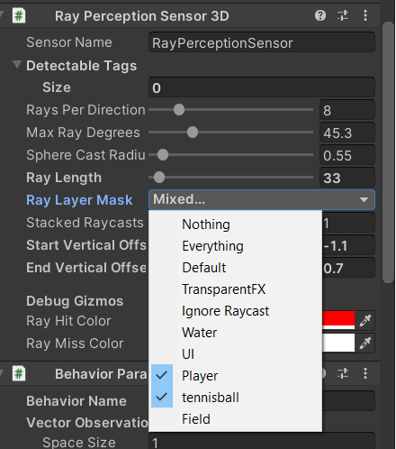

# DogTrainer - VR Experience

| Naam         | Studentennummer |
|--------------|-----------------|
| Dirckx Laura | s104004         |
| Cools Witse  | s110026         |
| Stoels James | s107197         |
| Szapinszky Yanu  | s107798         |
| Wannarueang Bunyarit | s094468         |


### Inhoudstafel

- [DogTrainer - VR Experience](#dogtrainer---vr-experience)
    - [Inhoudstafel](#inhoudstafel)
    - [Inleiding](#inleiding)
    - [Samenvatting](#samenvatting)
    - [Installatie](#installatie)
    - [One-pager](#one-pager)
    - [Verloop van het spel](#verloop-van-het-spel)
    - [Methoden](#methoden)
      - [Park](#park)
      - [BalSpawner](#balspawner)
      - [DogAgent](#dogagent)
    - [Trainen](#trainen)
      - [Training 1 - Witse](#training-1---witse)
      - [Training 2 - Wrun_9_WWalls](#training-2---wrun_9_wwalls)
      - [Training 3 - Yanu 1](#training-3---yanu-1)
      - [Training 4 - Yanu 2](#training-4---yanu-2)
      - [Training 5 - Yanu 3](#training-5---yanu-3)
      - [Training 6 - Yanu 4](#training-6---yanu-4)
      - [Training 7 - Witse Final](#training-7---witse-final)
    - [Conclusie](#conclusie)
    - [Bronvermelding](#bronvermelding)


### Inleiding

Omdat sommige mensen nog vaak bang zijn van honden hebben we besloten om een DogTrainer te maken. Deze VR-game zou hen kunnen helpen met het gewaarworden van een hond en zijn gedragingen.

Dit project is bedoeld om met een Oculus Quest VR-headset te spelen om de volledige emersie te beleven.

### Samenvatting

In deze tutorial zullen wij beschrijven wat u moet weten om dit project tot een goed einde te brengen. We zullen waar nodig extra toelichten en de belangrijkste scripts tonen. Na het volgen van deze tutorial kan u zelf een gelijkaardig project maken en spelen op uw eigen VR-headset.
Ons project zal een hond voorstellen waar de speler mee kan spelen. De speler kan een bal gooien, de hond zal deze dan terugbrengen.

Na deze tutorial bent u in staat dit project te reproduceren.

### Installatie

| Programma         | Versie |
|--------------|-----------------|
| Unity        | 2019.4.12f      |
| Visual Studio  | 2019          |
| ML Agents    | 1.2             |
| Python       | 3.8.6           |
| Tensorboard  | 2.4.0           |
| XR Interaction Toolkit | 0.9.4 |
| Oculus XR Plugin | 1.4.3       |

* Er worden twee packages gebruikt uit de asset store in Unity. Deze kan u installeren door op Window -> Asset Store te klikken en deze te installeren.

* Fantasy Skybox wordt gebruikt voor de skybox.
* Waldemarst wordt gebruikt voor de bomen.

### One-pager

Dit was onze [One-pager](One-Pager.pdf).

Na feedback van de lectoren en verder onderzoek zijn we volledig afgeweken van onze one-pager. Bij ons initieël idee was het niet echt duidelijk waar de AI-Toepassing zat. Daarom hebben we ervoor gekozen om een nieuw project uit te werken. Hierbij kunnen we ML-agents beter benutten.

### Verloop van het spel


### Methoden

#### Park

Als omgeving hebben we voor een park gekozen. Dit zal de omgeving zijn waarin zowel de hond als de speler zich kan bewegen.

#### BalSpawner

Voor het trainen is er een balSpawner script geschreven. Deze zal op random plaatsen binnen het veld een bal spawnen, die de hond dan moet gaan halen en naar de speler moet brengen.
Deze balSpawner is specifiek bedoeld voor het trainen. Later kunnen we dan de getrainde hond zijn brein geven door deze toe te voegen in de behaviour parameters van de hond.

Finaal wordt het BalSpawner script gebruikt dat hieronder zichtbaar is om de bal te laten spawnen op een tafel, waar de speler deze kan nemen en weggooien.
In dit script wordt ook gezorgd voor het herspawnen van de bal op de juiste positie.

```cs
public class Spawner : MonoBehaviour
{
    public GameObject tennisball;
    private GameObject tennisballContainer;
    private Dog dog;

    private void Update()
    {
       
            if (tennisball.transform.position.y < 0)
            {
                ClearEnvironment();
                SpawnBall();
            }
        
    }

    public void OnEnable()
    {

        tennisballContainer = transform.Find("TennisContainer").gameObject;
        dog = transform.GetComponentInChildren<Dog>();
    }
    public void ClearEnvironment()
    {
        foreach (Transform ball in tennisballContainer.transform)
        {
            GameObject.Destroy(ball.gameObject);
        }
    }
    public Vector3 RandomPosition(float up)
    {
        float x = Random.Range(-9.75f, 9.75f);
        float z = Random.Range(-9.75f, 9.75f);
        return new Vector3(x, up, z);
    }

    public void SpawnBall()
    {
        GameObject ball = Instantiate(tennisball.gameObject);
        ball.transform.SetParent(tennisballContainer.transform);
        
        ball.transform.localPosition = new Vector3(0.1804f, -0.0674f ,-00028f);
    }

    
}
```


#### DogAgent

Voor de hond wordt er een leeg GameObject voorzien met daarin de dog prefab en de tennisbal prefab. Als de hond de bal heeft wordt de tennisbal prefab in het lege hond GameObject zichtbaar gemaakt, zodat de hond met een bal in zijn mond verder loopt. Als de hond geen bal heeft, wordt deze bal onzichtbaar gemaakt.


Dit script zorgt er ook voor dat de hond op de juiste plaats spawnt. Hierin wordt ook alle logica rond trainen, beloningssysteem en episodes afgehandeld.  
Dit script zorgt er ook voor dat de hond met de pijltjes toetsen bestuurd kan worden.
Hiernaast gebeurt alle collision-detection ook in dit script. De hond heeft ook een Ray Perception Sensor. Hierin specifiëren we dat de hond enkel de Player en de tennisbal kan zien. Om te voorkomen dat hij 'verdwaald' rondloopt.




Met als referentie Obelix script van ML-agents github [kijk bronvermelding](#bronvermelding).

```cs
public class Dog : Agent
{
    private Spawner spawner;
    private Rigidbody body;
    public float speed = 10;
    public float rotationSpeed = 350;
    bool ballInMouth;
    public GameObject tBall;
    public GameObject player;


    public void Update()
    {
        fell();
    }

    public override void Initialize()
    {
        base.Initialize();
        body = GetComponent<Rigidbody>();
        spawner = GetComponentInParent<Spawner>();
        ballInMouth = false;
        transform.localPosition = new Vector3(1.733055f, 1.3f, -17.78904f);
        body.angularVelocity = Vector3.zero;
        body.velocity = Vector3.zero;

    }

    public override void OnEpisodeBegin()
    {
        spawner.ClearEnvironment();
        spawner.SpawnBall();
        tBall.SetActive(false);
    }
    public override void Heuristic(float[] actionsOut)
    {
        actionsOut[0] = 0f;
        actionsOut[1] = 0f;

        if (Input.GetKey(KeyCode.UpArrow)) // Moving fwd
        {
            actionsOut[0] = 2f;

        }
        else if (Input.GetKey(KeyCode.DownArrow)) // Turning left
        {
            actionsOut[0] = 1f;

        }
        else if (Input.GetKey(KeyCode.LeftArrow)) // Turning left
        {
            actionsOut[1] = 1f;

        }
        else if (Input.GetKey(KeyCode.RightArrow)) // Turning right
        {
            actionsOut[1] = 2f;

        }
    }


    //code van Meneer Dhaese bij Obelix.cs - MLAgents - VR Experience github
    public override void OnActionReceived(float[] vectorAction)
    {      
        //bij stilstaan afstraffen
        if (vectorAction[0] == 0 )
        {

            AddReward(-0.001f);
            return;
        }

        if (vectorAction[0] != 0)
        {
            Vector3 translation = transform.forward * speed * (vectorAction[0] * 2 - 3) * Time.deltaTime;
            transform.Translate(translation, Space.World);
        }

        if (vectorAction[1] != 0)
        {
            float rotation = rotationSpeed * (vectorAction[1] * 2 - 3) * Time.deltaTime;
            transform.Rotate(0, rotation, 0);
        }

    }


    void OnCollisionEnter(Collision collision)
    {
        if (collision.gameObject.CompareTag("tennisball") && !ballInMouth)
        {
            //load material of dog with ball in mouth
            ballInMouth = true;
            tBall.SetActive(true);
            spawner.ClearEnvironment();
            // add reward for getting ball
            AddReward(0.5f);

        }

        if (collision.gameObject.CompareTag("Player") && ballInMouth)
        {
            
            ballInMouth = false;

            //add reward for returning ball to player
            AddReward(1f);


            EndEpisode();
        }
        else if (collision.gameObject.CompareTag("Player") && !ballInMouth)
        {

            //ballInMouth = false;
            AddReward(-0.5f);
        }

    }

    public override void CollectObservations(VectorSensor sensor)
    {
        sensor.AddObservation(ballInMouth);


    }

    public void fell()
    {
        if (GameObject.Find("Dog").transform.position.y < 0)
        {
            
            AddReward(-1f);
            ballInMouth = false;
            EndEpisode();
        }
        
        
    }

}
```

### Trainen

#### Training 1 - Witse

****yaml parameters****:
```cs
behaviors:
  Dog:
    trainer_type: ppo
    max_steps: 5.0e7
    time_horizon: 64
    summary_freq: 10000
    keep_checkpoints: 5
    checkpoint_interval: 50000
    
    hyperparameters:
      batch_size: 32
      buffer_size: 9600
      learning_rate: 3.0e-4
      learning_rate_schedule: constant
      beta: 5.0e-3
      epsilon: 0.2
      lambd: 0.95
      num_epoch: 3

    network_settings:
      num_layers: 2
      hidden_units: 128
      normalize: false
      vis_encoder_type: simple

    reward_signals:
      extrinsic:
        strength: 1.0
        gamma: 0.99
      curiosity:
        strength: 0.02
        gamma: 0.99
        encoding_size: 256
        learning_rate : 1e-3
```
****Rewardsysteem****: 

| Actie         | Reward |
|--------------|-----------------|
| Hond gaat naar speler zonder bal         | -0.1f      |
| Hond gaat naar speler met bal  | +1.0f          |
| Hond pakt bal    | +0.5f             |
| Hond staat stil       | -0.001f           |
| Hond valt van de map  | -0.1f           |


* Smoothed: 1.299
* Value: 1.392
* Step: 510K
* Runtime: 1h 19m 52s

****conclusie****: Zonder muren getraind, goede resultaten. Volgende keer met muren proberen trainen, zien of de resultaten even goed blijven.

#### Training 2 - Wrun_9_WWalls

****yaml parameters****:
```cs
behaviors:
  Dog:
    trainer_type: ppo
    max_steps: 5.0e7
    time_horizon: 64
    summary_freq: 10000
    keep_checkpoints: 5
    checkpoint_interval: 50000
    
    hyperparameters:
      batch_size: 32
      buffer_size: 9600
      learning_rate: 3.0e-4
      learning_rate_schedule: constant
      beta: 5.0e-3
      epsilon: 0.2
      lambd: 0.95
      num_epoch: 3

    network_settings:
      num_layers: 2
      hidden_units: 128
      normalize: false
      vis_encoder_type: simple

    reward_signals:
      extrinsic:
        strength: 1.0
        gamma: 0.99
      curiosity:
        strength: 0.02
        gamma: 0.99
        encoding_size: 256
        learning_rate : 1e-3
```
****Rewardsysteem****: 

| Actie         | Reward |
|--------------|-----------------|
| Hond gaat naar speler zonder bal         | -0.1f      |
| Hond gaat naar speler met bal  | +1.0f          |
| Hond pakt bal    | +0.5f             |
| Hond staat stil       | -0.001f           |
| Hond valt van de map  | -0.1f           |


****conclusie****: Met muren getraind, minder goede resultaten.

#### Training 3 - Yanu 1

****yaml parameters****:
```cs
behaviors:
  Dog:
    trainer_type: ppo
    max_steps: 5.0e7
    time_horizon: 64
    summary_freq: 10000
    keep_checkpoints: 5
    checkpoint_interval: 50000
    
    hyperparameters:
      batch_size: 32
      buffer_size: 9600
      learning_rate: 3.0e-4
      learning_rate_schedule: constant
      beta: 5.0e-3
      epsilon: 0.2
      lambd: 0.95
      num_epoch: 3

    network_settings:
      num_layers: 2
      hidden_units: 128
      normalize: false
      vis_encoder_type: simple

    reward_signals:
      extrinsic:
        strength: 1.0
        gamma: 0.99
      curiosity:
        strength: 0.01
        gamma: 0.99
        encoding_size: 256
        learning_rate : 1e-3
```


****Rewardsysteem****: 

| Actie         | Reward |
|--------------|-----------------|
| Hond gaat naar speler zonder bal         | -0.1f      |
| Hond gaat naar speler met bal  | +1.0f          |
| Hond pakt bal    | +0.3f             |
| Hond staat stil       | -0.001f           |


****conclusie****: Zonder muren. Episode wordt opnieuw gestart als agent van het veld valt. Met curiousity strength 0.01 getraind. Ongeveer dezelfde resultaten.

#### Training 4 - Yanu 2

****yaml parameters****:
```cs
behaviors:
  Dog:
    trainer_type: ppo
    max_steps: 5.0e7
    time_horizon: 64
    summary_freq: 10000
    keep_checkpoints: 5
    checkpoint_interval: 50000
    
    hyperparameters:
      batch_size: 32
      buffer_size: 9600
      learning_rate: 3.0e-4
      learning_rate_schedule: constant
      beta: 5.0e-3
      epsilon: 0.2
      lambd: 0.95
      num_epoch: 3

    network_settings:
      num_layers: 2
      hidden_units: 128
      normalize: false
      vis_encoder_type: simple

    reward_signals:
      extrinsic:
        strength: 1.0
        gamma: 0.99
      curiosity:
        strength: 0.02
        gamma: 0.99
        encoding_size: 256
        learning_rate : 1e-3
```


****Rewardsysteem****: 

| Actie         | Reward |
|--------------|-----------------|
| Hond gaat naar speler zonder bal         | -0.1f      |
| Hond gaat naar speler met bal  | +1.0f          |
| Hond pakt bal    | +0.3f             |
| Hond staat stil       | -0.001f           |


****conclusie****: Zonder muren. Episode wordt opnieuw gestart als agent van het veld valt. Met curiousity strength 0.02 getraind. Niet erg veel verschil, gaat wel iets sneller dan de vorige.

#### Training 5 - Yanu 3

****yaml parameters****:
```cs
behaviors:
  Dog:
    trainer_type: ppo
    max_steps: 5.0e7
    time_horizon: 64
    summary_freq: 10000
    keep_checkpoints: 5
    checkpoint_interval: 50000
    
    hyperparameters:
      batch_size: 32
      buffer_size: 9600
      learning_rate: 3.0e-4
      learning_rate_schedule: constant
      beta: 5.0e-3
      epsilon: 0.2
      lambd: 0.95
      num_epoch: 3

    network_settings:
      num_layers: 2
      hidden_units: 128
      normalize: false
      vis_encoder_type: simple

    reward_signals:
      extrinsic:
        strength: 1.0
        gamma: 0.99
      curiosity:
        strength: 0.03
        gamma: 0.99
        encoding_size: 256
        learning_rate : 1e-3
```


****Rewardsysteem****: 

| Actie         | Reward |
|--------------|-----------------|
| Hond gaat naar speler zonder bal         | -0.1f      |
| Hond gaat naar speler met bal  | +1.0f          |
| Hond pakt bal    | +0.3f             |
| Hond staat stil       | -0.001f           |


****conclusie****: Zonder muren. Episode wordt opnieuw gestart als agent van het veld valt. Met curiousity strength 0.03. Niet erg veel verschil. 

#### Training 6 - Yanu 4

****yaml parameters****:
```cs
behaviors:
  Dog:
    trainer_type: ppo
    max_steps: 5.0e7
    time_horizon: 64
    summary_freq: 10000
    keep_checkpoints: 5
    checkpoint_interval: 50000
    
    hyperparameters:
      batch_size: 32
      buffer_size: 9600
      learning_rate: 3.0e-4
      learning_rate_schedule: constant
      beta: 5.0e-3
      epsilon: 0.2
      lambd: 0.95
      num_epoch: 3

    network_settings:
      num_layers: 2
      hidden_units: 128
      normalize: false
      vis_encoder_type: simple

    reward_signals:
      extrinsic:
        strength: 1.0
        gamma: 0.99
      curiosity:
        strength: 0.02
        gamma: 0.99
        encoding_size: 256
        learning_rate : 1e-3
```


****Rewardsysteem****: 

| Actie         | Reward |
|--------------|-----------------|
| Hond gaat naar speler zonder bal         | -0.1f      |
| Hond gaat naar speler met bal  | +1.0f          |
| Hond pakt bal    | +0.5f             |
| Hond staat stil       | -0.001f           |
| Hond valt van de map  | -1f           |


****conclusie****: Zonder muren. Episode wordt opnieuw gestart als agent van het veld valt. Met curiousity strength 0.02.

#### Training 7 - Witse Final

****yaml parameters****:
```cs
behaviors:
  Dog:
    trainer_type: ppo
    max_steps: 5.0e7
    time_horizon: 64
    summary_freq: 10000
    keep_checkpoints: 5
    checkpoint_interval: 50000
    
    hyperparameters:
      batch_size: 32
      buffer_size: 9600
      learning_rate: 3.0e-4
      learning_rate_schedule: constant
      beta: 5.0e-3
      epsilon: 0.2
      lambd: 0.95
      num_epoch: 3

    network_settings:
      num_layers: 2
      hidden_units: 128
      normalize: false
      vis_encoder_type: simple

    reward_signals:
      extrinsic:
        strength: 1.0
        gamma: 0.99
      curiosity:
        strength: 0.02
        gamma: 0.99
        encoding_size: 256
        learning_rate : 1e-3
```


****Rewardsysteem****: 

| Actie         | Reward |
|--------------|-----------------|
| Hond gaat naar speler zonder bal         | -0.5f      |
| Hond gaat naar speler met bal  | +1.0f          |
| Hond pakt bal    | +0.5f             |
| Hond staat stil       | -0.001f           |
| Hond valt van de map  | -1f           |


****conclusie****: Deze training is zonder muren. De Episode wordt opnieuw gestart als de hond de bal terugbrengt bij de speler. Na een bug in het implementeren van het rewardsysteem gevonden te hebben, is er nog een finale training gebeurd. Deze leverde veel betere resultaten op.

### Conclusie
We hebben via machine learning een hond getraind om een bal te halen en terug te brengen naar de speler.

Het trainen bracht meerdere onverwachte problemen met zich mee. Na wat bugfixes hebben we de juiste combinatie van rewards gevonden. Dit zijnde training 7. Dit is een training zonder muren.

Het project op deze unieke manier beleven was echter een uitdaging. In de toekomst zou het enorm leuk zijn onze game allemaal eens écht te beleven op een VR-set.

### Bronvermelding

* Dhaese, D. D. (2020). Gedragingen van de agent en de andere spelobjecten. VR Experience (ML-Agents). https://ddhaese.github.io/ML-Agents/gedragingen-van-de-agent-en-de-andere-spelobjecten.html#obelix.cs
* Chen, L. C., & Berges, V. B. (2018, October 2). Puppo, The Corgi: Cuteness Overload with the Unity ML-Agents Toolkit. Unity Blog. https://blogs.unity3d.com/2018/10/02/puppo-the-corgi-cuteness-overload-with-the-unity-ml-agents-toolkit/
* Valem, V. (2020, June 15). Introduction to VR in Unity - PART 6 : RAY INTERACTION. Youtube. https://www.youtube.com/watch?v=4tW7XpAiuDg&start=839s
